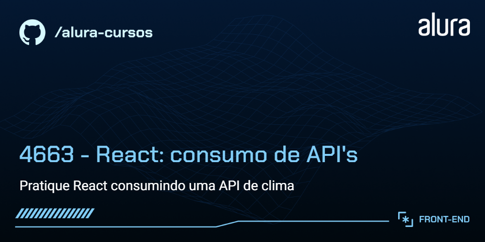
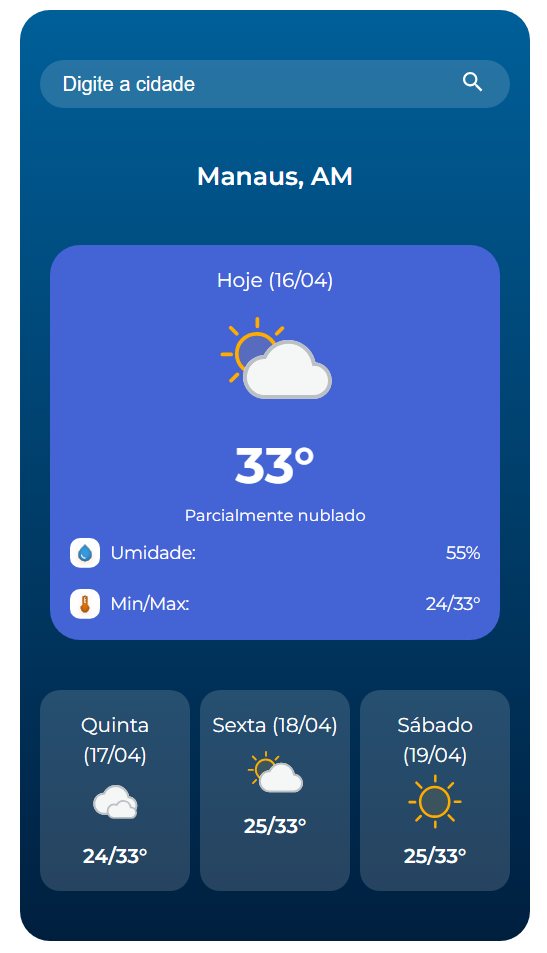

# Climapp

App de clima que consome uma API e exibe informações como temperatura e data atual, descrição do tempo, umidade, máx e min e previsão para os três próximos dias.

## 🔨 Funcionalidades do projeto

O App permite buscar uma cidade, qualquer cidade do Brasil, e mostra a temperatura atual, exibe um ícone mostrando o tempo, descrição do clima, umidade, temperaturas máximas e mínimas e previsão para os próximos três dias. 

## ✔️ Técnicas e tecnologias utilizadas

As técnicas e tecnologias utilizadas pra isso são:

- `React`: biblioteca de interface de usuários
- `CSS`: para estilos da aplicação
- `Vite`: ferramenta de build do app
- `Figma`: para prototipar o app
- `HG Brasil`: site da API utilizada para obter informações do clima

## 📁 Acesso ao projeto

Você pode [acessar o código fonte do projeto inicial](https://github.com/NeiltonSeguins/4663-praticando-react-apis).

## 🛠️ Abrir e rodar o projeto

Após baixar o projeto, você pode abrir com o seu editor de código favorito. Eu gosto de usar o [Visual Studio](https://code.visualstudio.com/), então recomendo que você também o use para ficarmos na mesma página. 

- **Baixe o projeto e extraia os arquivos para a pasta de sua preferência** 
- Abra a pasta no Visual Studio Code
- Instale as dependências usando o `npm install`
- Rode o app com o comando `npm run dev`
- Seu app está rodando provavelmente em `http://localhost:5173/`

## 📚 Mais informações do curso

Gostou do projeto e quer conhecer mais? Você pode [acessar o protótipo](https://www.figma.com/community/file/1491129858344649743) com todas as telas do app. 

